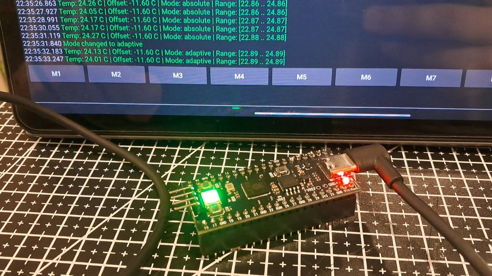

# RP2040-FreeRTOS - Temperature Visualization

The firmware periodically reads the internal temperature sensor, processes the data, and visualizes the temperature using a WS2812 (NeoPixel) RGB LED.



---

This repo uses base project for [FreeRTOS](https://freertos.org/) on the [Raspberry Pi RP2040 microcontroller](https://www.raspberrypi.com/products/rp2040/) by [Tony Smith](https://github.com/smittytone/)

## Hardware Used

- RP2040 board (tested on **YD-RP2040 with onboard NeoPixel**)
- RGB WS2812 LED
- One push-button connected with pull-up

**YD-RP2040** requires no additional hardware and/or soldering, but you can use any RP2040 board and connect a WS2812 LED.

Also, the project should be compatible with the RPi Pico 2 that has a **Cortex-M33** core.

| Board                   | Microcontroller | Cores | Architecture                        |
| ----------------------- | --------------- | ----- | ----------------------------------- |
| Raspberry Pi Pico       | RP2040          | 2     | ARM Cortex-M0+                      |
| Raspberry Pi Pico **2** | RP2350          | 2     | ARM **Cortex-M33** + Hazard3 RISC-V |

## Prerequisites
~1.0-1.5 GB of free disk space

gcc compiler toolchain for arm (not on host machine)

```
sudo apt install gcc-arm-none-eabi
```

## Usage

### Build steps

```bash
git clone https://github.com/maxmyk/RP2040-FreeRTOS-experiments
cd RP2040-FreeRTOS-experiments
git submodule update --init
cd pico-sdk && git submodule update --init && cd ..
cmake -S . -B build -D CMAKE_BUILD_TYPE=Debug # or Release
cmake --build build
# For the Pico (RP2040)
export PICO_BOARD=pico
```

### Code upload

1. Connect RPi to your computer
2. Press and hold `BOOT` button
3. Click `RST`
4. Release `BOOT` button
5. The computer should recognize the Pico as a mass storage device
6. Copy the generated `TEMPERATURE.uf2` file from `build/App-Temperature` to the Pico's storage device

## What it does

### Visualization modes

The RGB LED displays temperature using a color gradient. Color scale: `Blue-Cyan-Green-Yellow-Red`

Two visualization modes are available:

#### Absolute Heat Mode

- Maps temperature to a fixed range (default: 15 °C to 35 °C)

#### Adaptive Heat Mode

- Automatically tracks coldest and hottest observed temperatures
- Dynamically stretches color gradient across the observed range

### Tasks

#### Temperature Task (1 Hz)

- Reads and calibrates temperature
- Updates adaptive temperature range
- Signals new sample availability

#### UI Task (50 Hz)

- Reads button state - a single push-button toggles visualization modes
- Handles mode switching with debounce

#### LED Task (10 Hz)

- Computes display color
- Updates WS2812 LED via RP2040 PIO state machine
- Generates heartbeat pulse (the onboard LED provides a short blink whenever a new temperature sample is processed.)

---

This project was created as a prototyping exercise to demonstrate:
- ability to learn and integrate FreeRTOS quickly
- use of RP2040 hardware peripherals (ADC, PIO, GPIO)
- real-time task scheduling design
- signal smoothing and adaptive visualization
- hardware-driven UI with button input


## Credits

Built by maxmyk on top of the [original repo as a template](https://github.com/smittytone/RP2040-FreeRTOS).

The version of the `FreeRTOSConfig.h` file included here was derived from [work by @yunka2](https://github.com/yunkya2/pico-freertos-sample) and modified by maxmyk.

## Copyright and Licences

Application source © 2025, Tony Smith and licensed under the terms of the [MIT Licence](./LICENSE.md).

[FreeRTOS](https://freertos.org/) © 2021, Amazon Web Services, Inc. It is also licensed under the terms of the [MIT Licence](./LICENSE.md).

The [Raspberry Pi Pico SDK](https://github.com/raspberrypi/pico-sdk) is © 2025, Raspberry Pi (Trading) Ltd. It is licensed under the terms of the [BSD 3-Clause "New" or "Revised" Licence](https://github.com/raspberrypi/pico-sdk/blob/master/LICENSE.TXT).
